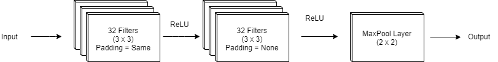
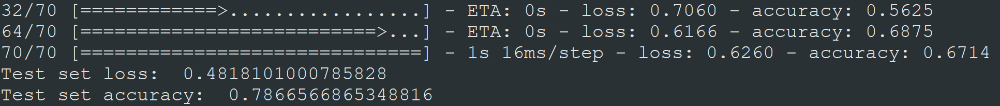

# FixEye

health++ Stanford’s Health Hackathon 2019 project: Low resource areas lack preventive and screening services, which causes millions of deaths per year. Our mission is to detect chronic diseases through non-invasive retinal scans. We trained a convolutional neural network in order to determine if someone has a chance of having Diabetic Retinopathy. We used the Messidor dataset to train our model. Special thanks to Michael D. Abramoff, MD, PhD, who is an expert in the field of Retinal Imaging, for making this dataset publicly available. By using his dataset, we are able to determine if a person has the possibility of having Diabetic Retinopathy with an accuracy of 78%.

## Neural Networks

Our neural network consists of two filtering layers and a MaxPool layer. A diagram of our Machine Learning algorithm can be seen above. neural_networks.py includes these above steps.

## Accuracy

Our Machine Learning Model has a 78% accuracy in detecting Diabetic Retinopathy by using the fundus images from the Messidor dataset.

## Functions
functions.py includes various histogram equalizing methods in opencv, which allowed us to check out the various outcomes of the test runs.

## Settings
settings.py allows an easier platform to edit the learning process.

## Main
Imports all the other functions and trains the convolutional neural network. 

## More Info
More information about the aim of our project can be found in the presentation and on [Devpost](https://devpost.com/software/fixeye)

## Credits
This project was created with the collaboration of:
1) [Can Koz](https://github.com/canxkoz)
2) [Sanjiv Soni](https://github.com/sanjivsoni)
3) [Schahrouz Kakavand](https://github.com/schahrouz)

## Imports 
imports.py contains everything that is necessary for 
- [Keras](https://keras.io/)
- [OpenCV](https://opencv.org/)
- [TensorFlow](https://www.tensorflow.org/)
